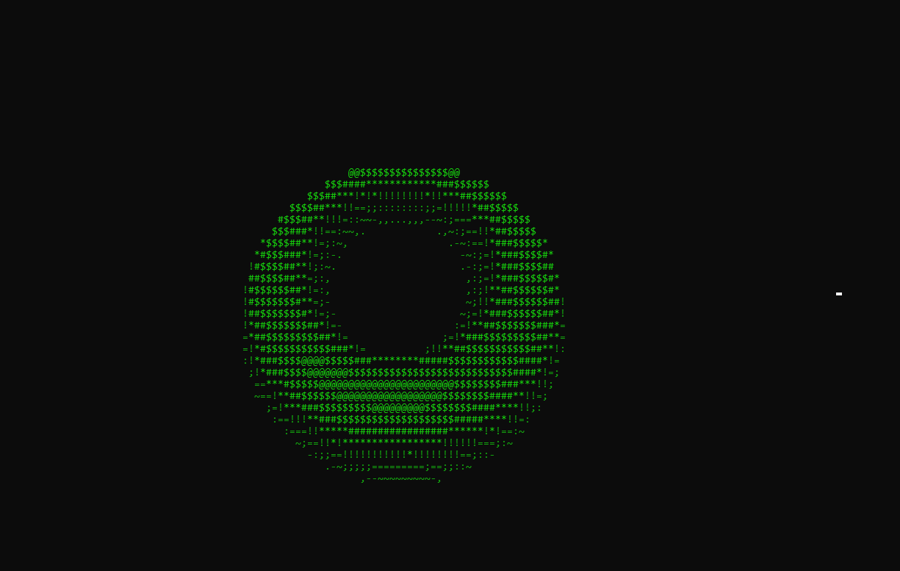

# 3DViewer-cmd

Based on the original donut code by Andy Sloane (https://www.a1k0n.net/2011/07/20/donut-math.html).
I modified the original code and modified it to be able to change its rotation, size and position. After that, I make it an abstract class from which you can make objects to display on the screen.

The original code and the refactor in c can be found in the OriginalCode folder.

## Features

- can display multiple objects on screen - easy to make new classes to create new objects.
- the class Display takes care of the work of rendering everything.

## Cons

- only donut and sphere available for now.
- only 8 color to render: black, white, red, green, yellow, blue, cyan and magenta.
- to add more shapes you need to provide a math function for each one of them.

## Pictures

